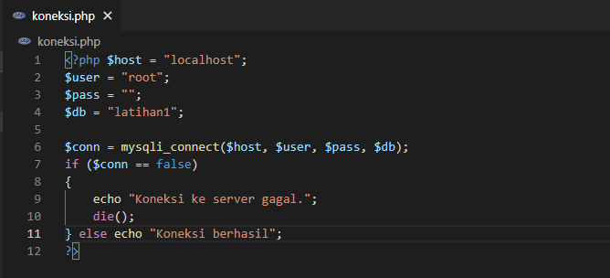

# Lab8Web

# NAMA  : Ibnu Fajar
# NIM   : 312010420
# KELAS : TI. 20. A1

**Langkah-langkah Praktikum** 
**Persiapan** 
Untuk memulai membuat aplikasi CRUD sederhana, yang perlu disiapkan adalah database server menggunakan MySQL. Pastikan MySQL Server sudah dapat dijalankan
melalui XAMPP. 

**Menjalankan MySQL Server** 
Untuk menjalankan MySQL Server dari menu XAMPP Contol. 
 
**Mengakses MySQL Client menggunakan PHP MyAdmin**
Pastikan webserver Apache dan MySQL server sudah dijalankan. Kemudian buka melalui browser: *http://localhost/phpmyadmin/* 

**Membuat Data Base** 
 
**Membuat Tabel** 
 
**Menambahkan Data**
 
 

**Membuat Program CRUD** 
Buat folder lab8_php_database pada root directory web server (d:\xampp\htdocs)Kemudian untuk mengakses direktory tersebut pada web server dengan mengakses URL: *http://localhost lab8_php_database/* 
 

**Membuat file koneksi database** 
Buat file baru dengan nama koneksi.php 
 
Buka melalui browser untuk menguji koneksi database (untuk menyampilkan pesan koneksi berhasil, uncomment pada perintah echo “koneksi berhasil”; 
 

**Membuat file index untuk menampilkan data (Read)** 
Buat file baru dengan nama **index.php** 
 

